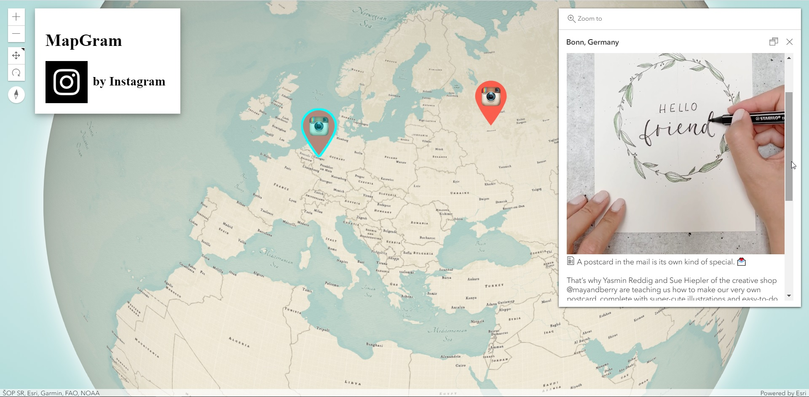

# MapGram
Visualizador de fotos do Instagram em um mapa 3D

  

[Abrir aplicação](https://lucassoaresribeiro.github.io/map-gram?username=instagram)

## Tecnologias

- [ArcGIS API for JavaScript](https://developers.arcgis.com/javascript/)